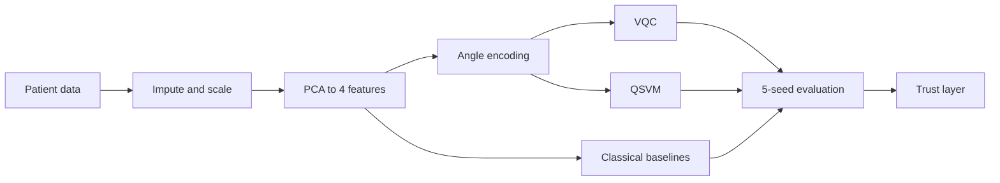

# JeevSetu

Hybrid quantum-classical machine learning for early detection of heart disease and breast cancer, with a trust layer that explains predictions and abstains when it shouldn't answer.

Built for Smart India Hackathon 2026, Problem Statement 139.

**Live prototype:** https://jeevsetu.onrender.com

Contents: [Why](#why) · [What it does](#what-it-does) · [Results](#results) · [How it works](#how-it-works) · [Datasets](#datasets) · [Running locally](#running-locally) · [Limitations](#limitations) · [Roadmap](#roadmap)

---

## Why

Heart disease and cancer are often caught late in India. Machine learning can help with early screening, but two things get in the way: clinical datasets are small, and most models return a confident answer even when they have no basis for one.

Quantum machine learning is often suggested for small, high-dimensional data. We wanted to test that claim properly instead of assuming it. JeevSetu is organised around three questions:

1. Does quantum ML actually do better than classical ML on real medical data?
2. How does it hold up under the noise of real quantum hardware?
3. Can a doctor trust what the model says about a specific patient?

## What it does

The app has two modes. Research Mode is the working prototype. Patient Mode is in development.

| Page | Purpose | Data |
|:---|:---|:---|
| Advantage Observatory | Quantum vs classical results side by side, with error bars across 5 seeds | Real |
| Predict & Trust | Risk estimate, confidence, adjustable decision threshold and trust evidence for one patient. If the patient is outside the training range, the model abstains and shows no probability | Real |
| Explain | How much each clinical value pushed the risk up or down, with live what-if editing | Simulated |
| Hardware Reality Lab | Model performance under simulated hardware noise profiles | Simulated |
| Failure Envelope | The noise and data-corruption conditions where the model stops being reliable | Simulated |
| Small-Data Explorer | Performance as the training set shrinks | Simulated |
| Scalability Lab | Accuracy against training cost as qubit count grows | Simulated |
| Model Evolution Engine | Accuracy against circuit depth across about twenty tested circuit designs | Simulated |
| Cross-Modality | Compares how well each type of heart test predicts on its own and combined (heart disease only) | Simulated |
| Clinician Report | PDF export of the prediction, confidence, evidence and explanation | Simulated |

Every results page carries a REAL or SIMULATED label in the app, so it is always clear which numbers come from trained models.

Other details: a plain-language toggle, light and dark themes, a projector mode (`Shift+P`), a command palette (`Ctrl+K`) and full keyboard navigation.

## Results

Area under the ROC curve (AUC), mean ± standard deviation over 5 random seeds. Each seed uses a different stratified 80/20 train/test split.

| Model | Type | Heart disease (n=303) | Breast cancer (n=569) |
|:---|:---|:---:|:---:|
| VQC, 4 qubits | Quantum | **0.904 ± 0.033** | **0.967 ± 0.012** |
| QSVM, ZZ kernel, 4 qubits | Quantum | 0.740 ± 0.059 | 0.781 ± 0.049 |
| Logistic regression, 4 PCA features | Classical | 0.909 ± 0.026 | 0.982 ± 0.009 |
| SVM (RBF), 4 PCA features | Classical | 0.898 ± 0.025 | 0.981 ± 0.011 |
| Random forest, 4 PCA features | Classical | 0.891 ± 0.038 | 0.974 ± 0.015 |
| XGBoost, 4 PCA features | Classical | 0.889 ± 0.037 | 0.973 ± 0.012 |
| Best classical, all features | Classical | 0.907 ± 0.028 | 0.988 ± 0.007 |

What we take from this:

- On heart disease, the 4-qubit VQC and the best classical model are within seed-to-seed variance of each other. We read that as a tie, not a win.
- On breast cancer, the VQC trails the best classical model by about 1.5 AUC points.
- The QSVM is clearly weaker on both datasets. We think the kernel is too spread out at this feature scaling and plan to tune its bandwidth.
- Reducing the classical models from all features to 4 PCA features costs them very little, so comparing against a 4-qubit model is fair.

<details>
<summary>Accuracy, F1 and sensitivity</summary>

| Dataset | Model | Accuracy | F1 | Sensitivity |
|:---|:---|:---:|:---:|:---:|
| Heart | VQC | 0.830 ± 0.064 | 0.809 ± 0.071 | 0.786 ± 0.067 |
| Heart | QSVM | 0.682 ± 0.030 | 0.600 ± 0.024 | 0.521 ± 0.060 |
| Heart | Logistic regression | 0.849 ± 0.029 | 0.834 ± 0.029 | 0.821 ± 0.025 |
| Heart | SVM | 0.859 ± 0.044 | 0.846 ± 0.045 | 0.836 ± 0.041 |
| Heart | Random forest | 0.843 ± 0.051 | 0.826 ± 0.050 | 0.807 ± 0.032 |
| Heart | XGBoost | 0.810 ± 0.038 | 0.789 ± 0.046 | 0.779 ± 0.064 |
| Breast cancer | VQC | 0.905 ± 0.016 | 0.874 ± 0.022 | 0.895 ± 0.046 |
| Breast cancer | QSVM | 0.737 ± 0.046 | 0.605 ± 0.069 | 0.548 ± 0.067 |
| Breast cancer | Logistic regression | 0.932 ± 0.019 | 0.904 ± 0.027 | 0.876 ± 0.039 |
| Breast cancer | SVM | 0.926 ± 0.013 | 0.900 ± 0.018 | 0.895 ± 0.040 |
| Breast cancer | Random forest | 0.923 ± 0.019 | 0.896 ± 0.024 | 0.900 ± 0.031 |
| Breast cancer | XGBoost | 0.928 ± 0.017 | 0.902 ± 0.023 | 0.900 ± 0.039 |

All classical rows use the same 4 PCA features as the quantum models.

</details>

## How it works



**Preprocessing.** Missing values are imputed with the training-split mode. StandardScaler and PCA are fit on the training split only, then applied to the test split. The 4 principal components are scaled to [0, π] for angle encoding, one feature per qubit.

**Quantum models.** Both run on PennyLane's `lightning.qubit` simulator.
- VQC: `AngleEmbedding` followed by 2 `StronglyEntanglingLayers`, trained with Adam for up to 40 epochs, batch size 16.
- QSVM: a ZZ feature-map kernel computed from the state vector, passed to scikit-learn's `SVC` as a precomputed kernel. We checked the state-vector kernel against the overlap circuit on random pairs (max difference ~3e-17).

**Classical baselines.** Logistic regression, SVM with an RBF kernel, random forest and XGBoost, each trained on both the 4 PCA features and the full feature set.

**Trust layer.** For each patient, the app checks whether every input falls inside the training range and how strongly the evidence supports the prediction. If a patient is outside that range (for example, a 23-year-old when training ages ran from 29 to 77), the model abstains and refers the case to a doctor instead of showing a probability.

## Datasets

In use:

| Dataset | Patients | Source |
|:---|:---:|:---|
| Heart Disease (Cleveland) | 303 | [UCI Machine Learning Repository](https://archive.ics.uci.edu/dataset/45/heart+disease) |
| Breast Cancer Wisconsin (Diagnostic) | 569 | [UCI Machine Learning Repository](https://archive.ics.uci.edu/dataset/17/breast+cancer+wisconsin+diagnostic) |

Heart disease uses `processed.cleveland.data` with 13 features; the target is binarised (any value above 0 counts as disease). Breast cancer uses the 10 "mean" features, loaded through scikit-learn.

Planned next:

| Dataset | Patients | Source |
|:---|:---:|:---|
| Indian Liver Patient Dataset (collected in Andhra Pradesh) | 583 | [UCI](https://archive.ics.uci.edu/dataset/225/ilpd+indian+liver+patient+dataset) |
| Pima Indians Diabetes | 768 | [Kaggle](https://www.kaggle.com/datasets/uciml/pima-indians-diabetes-database) |
| Chronic Kidney Disease | 400 | [UCI](https://archive.ics.uci.edu/dataset/336/chronic+kidney+disease) |
| Parkinson's (voice measurements) | 195 | [UCI](https://archive.ics.uci.edu/dataset/174/parkinsons) |

## Tech stack

- **Frontend:** [React](https://react.dev) with TypeScript, [Vite](https://vitejs.dev), Tailwind CSS, [React Three Fiber](https://r3f.docs.pmnd.rs) for the 3D views, Recharts, Framer Motion
- **Backend:** [FastAPI](https://fastapi.tiangolo.com) served with Uvicorn
- **Quantum ML:** [PennyLane](https://pennylane.ai) (`lightning.qubit`)
- **Classical ML:** [scikit-learn](https://scikit-learn.org), [XGBoost](https://xgboost.readthedocs.io)
- **Hosting:** [Render](https://render.com)

## Running locally

Requires Node 20.19+ and Python 3.11.

**Frontend only (fastest):**

```bash
cd frontend
npm install
npm run dev
```

**Full app (FastAPI serving the built frontend):**

```bash
cd frontend
npm install
VITE_USE_MOCK=false npm run build
cd ../backend
pip install -r requirements.txt
uvicorn app.main:app --port 8000
```

Then open http://localhost:8000. A health check is available at `/api/health`.

**Reproducing the ML results:**

1. Download `processed.cleveland.data` from the [UCI Heart Disease page](https://archive.ics.uci.edu/dataset/45/heart+disease) into `ml/data/`.
2. Run:

```bash
cd ml
pip install -r requirements.txt
python run_pipeline.py
python export_to_fixtures.py
```

The pipeline trains every model on both datasets across 5 seeds and takes around 20 minutes on a laptop CPU. Results are written to `ml/results/real_results.json`, and the export script loads them into the app.

### Project layout

```
backend/app/   FastAPI server and API routes
frontend/      React app (Research Mode and Patient Mode)
ml/            Preprocessing, quantum and classical models, results
docs/          Specification and planning notes
```

## Limitations

We would rather state these plainly than have someone find them:

- All quantum models run on a noise-free simulator. No experiments have been run on real quantum hardware yet.
- The hardware noise, failure envelope, small-data, scalability, model evolution, explain, cross-modality and clinician report pages use simulated data. They are labelled as such in the app.
- Two datasets of a few hundred patients each is small. The results show what 4-qubit models can do at this scale, not what they will do on larger data.
- The trust layer's out-of-range check is based on the training data's ranges. It catches obvious outliers, not every case where the model is unreliable.

## Roadmap

- [x] 5-seed benchmark of quantum and classical models on two diseases
- [x] Trust layer with abstention and per-feature explanations
- [x] Live deployment
- [ ] QSVM kernel bandwidth tuning
- [ ] Noise models from real IBM devices through Qiskit fake backends
- [ ] Runs on real quantum hardware
- [ ] More datasets: liver, diabetes, kidney and Parkinson's
- [ ] Patient Mode: safety triage with India's emergency numbers (112 and 108), a guided check one question at a time, plain-language results, in English, Hindi and Marathi
- [ ] Validation with clinicians

## Disclaimer

JeevSetu is a research prototype for decision support. It is not a medical device and does not provide a diagnosis. Do not use it to make clinical decisions without a qualified doctor.
