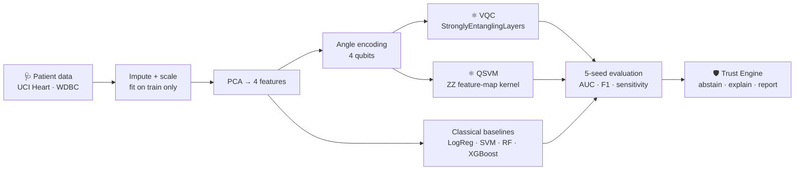

<div align="center">

<h1>JeevSetu · जीवसेतु</h1>

<p><b>Trustworthy hybrid quantum-classical machine learning for early disease detection</b></p>

<p><i>"Bridge of life": a bridge between quantum research and the patient.</i></p>

<p>
  <a href="https://jeevsetu.onrender.com"></a>
  
</p>

<p>
  
  
  
  
  
</p>

<p>
  <a href="#-results">Results</a> ·
  <a href="#-features">Features</a> ·
  <a href="#-how-it-works">How it works</a> ·
  <a href="#-run-it-locally">Run locally</a> ·
  <a href="#-roadmap">Roadmap</a>
</p>

</div>

<br>

<table align="center">
  <tr>
    <td align="center"><h2>872</h2>real patients</td>
    <td align="center"><h2>2</h2>diseases</td>
    <td align="center"><h2>6</h2>models compared</td>
    <td align="center"><h2>5</h2>seeds per result</td>
    <td align="center"><h2>4</h2>qubits</td>
  </tr>
</table>

<br>

<!-- SCREENSHOT: add a hero screenshot of the Overview page at docs/screenshots/hero.png -->
<p align="center">
  
</p>

---

## 🩺 The problem

In India, **heart disease and cancer are often caught late**, when treatment is harder and costlier. AI could help, but two things stop it from reaching patients:

> **Small data.** Clinical datasets are tiny, so models overfit and behave unpredictably.
>
> **Black boxes.** Most models answer confidently even when they're wrong, and a confident wrong answer in medicine can cost a life.

Quantum machine learning is often pitched as the answer for small, complex data. But claims of "quantum advantage" are rarely tested fairly.

## 💡 Our approach: three honest questions

JeevSetu doesn't assume quantum is better. It **measures** it.

<table>
  <tr>
    <td width="33%" valign="top">
      <h3>I · Does it help?</h3>
      A fair quantum vs classical benchmark on real patient data, with seed variance on every number.
      <br><br><sub>Advantage Observatory · Small-Data Explorer · Scalability Lab · Model Evolution</sub>
    </td>
    <td width="33%" valign="top">
      <h3>II · Does it survive reality?</h3>
      The same models under the noise of real IBM quantum devices, and the exact point where they break.
      <br><br><sub>Hardware Reality Lab · Failure Envelope</sub>
    </td>
    <td width="33%" valign="top">
      <h3>III · Can we trust it?</h3>
      Every prediction explained. When the model shouldn't answer, it <b>abstains</b> instead of guessing.
      <br><br><sub>Predict & Trust · Explain · Cross-Modality · Clinician Report</sub>
    </td>
  </tr>
</table>

---

## 📊 Results

<div align="center">

### A 4-qubit quantum classifier ties classical models on heart disease.

</div>

Trained on real data: **UCI Heart Disease** (303 patients) and **Wisconsin Breast Cancer** (569 patients). AUC shown as mean ± std over **5 random seeds**.

| Model | Type | ❤️ Heart Disease | 🎗️ Breast Cancer |
|:---|:---:|:---:|:---:|
| **VQC** · 4 qubits | ⚛️ Quantum | **0.904 ± 0.033** | **0.967 ± 0.012** |
| QSVM · ZZ kernel, 4 qubits | ⚛️ Quantum | 0.740 ± 0.059 | 0.781 ± 0.049 |
| Logistic Regression · 4 PCA | Classical | 0.909 ± 0.026 | 0.982 ± 0.009 |
| SVM · 4 PCA | Classical | 0.898 ± 0.025 | 0.981 ± 0.011 |
| Random Forest · 4 PCA | Classical | 0.891 ± 0.038 | 0.974 ± 0.015 |
| XGBoost · 4 PCA | Classical | 0.889 ± 0.037 | 0.973 ± 0.012 |
| Best classical · all features | Classical | 0.907 ± 0.028 | 0.988 ± 0.007 |

<table>
  <tr>
    <td>✅ <b>Heart disease:</b> VQC 0.904 vs best classical 0.909. The gap is smaller than the seed variance, a statistical tie.</td>
  </tr>
  <tr>
    <td>✅ <b>Breast cancer:</b> VQC within ~1.5 AUC points of classical.</td>
  </tr>
  <tr>
    <td>⚠️ <b>QSVM underperforms</b>, and we report it openly. Kernel bandwidth tuning is next.</td>
  </tr>
  <tr>
    <td>⚖️ <b>Fair comparison:</b> classical models lose almost nothing going from all features to 4, so a 4-qubit test is fair.</td>
  </tr>
</table>

<p align="center"><b><i>We don't claim quantum advantage. We measure it.</i></b></p>

<details>
<summary><b>Full metrics (accuracy, F1, sensitivity)</b></summary>
<br>

| Dataset | Model | Features | Accuracy | F1 | Sensitivity |
|:---|:---|:---:|:---:|:---:|:---:|
| Heart | VQC | PCA-4 | 0.830 ± 0.064 | 0.809 ± 0.071 | 0.786 ± 0.067 |
| Heart | QSVM | PCA-4 | 0.682 ± 0.030 | 0.600 ± 0.024 | 0.521 ± 0.060 |
| Heart | Logistic Regression | PCA-4 | 0.849 ± 0.029 | 0.834 ± 0.029 | 0.821 ± 0.025 |
| Heart | SVM | PCA-4 | 0.859 ± 0.044 | 0.846 ± 0.045 | 0.836 ± 0.041 |
| Heart | Random Forest | PCA-4 | 0.843 ± 0.051 | 0.826 ± 0.050 | 0.807 ± 0.032 |
| Heart | XGBoost | PCA-4 | 0.810 ± 0.038 | 0.789 ± 0.046 | 0.779 ± 0.064 |
| Breast Cancer | VQC | PCA-4 | 0.905 ± 0.016 | 0.874 ± 0.022 | 0.895 ± 0.046 |
| Breast Cancer | QSVM | PCA-4 | 0.737 ± 0.046 | 0.605 ± 0.069 | 0.548 ± 0.067 |
| Breast Cancer | Logistic Regression | PCA-4 | 0.932 ± 0.019 | 0.904 ± 0.027 | 0.876 ± 0.039 |
| Breast Cancer | SVM | PCA-4 | 0.926 ± 0.013 | 0.900 ± 0.018 | 0.895 ± 0.040 |
| Breast Cancer | Random Forest | PCA-4 | 0.923 ± 0.019 | 0.896 ± 0.024 | 0.900 ± 0.031 |
| Breast Cancer | XGBoost | PCA-4 | 0.928 ± 0.017 | 0.902 ± 0.023 | 0.900 ± 0.039 |

</details>

---

## ✨ Features

Every page in the app is labelled **REAL** (trained results) or **SIMULATED** (prototype data, pipeline in progress), so nothing is passed off as more than it is.

<!-- SCREENSHOTS: add these four images to docs/screenshots/ -->
<table>
  <tr>
    <td width="50%"><p align="center"><b>Advantage Observatory</b><br><sub>Quantum vs classical, with seed-variance error bars</sub></p></td>
    <td width="50%"><p align="center"><b>Predict & Trust</b><br><sub>Abstains instead of guessing on unusual patients</sub></p></td>
  </tr>
  <tr>
    <td width="50%"><p align="center"><b>Hardware Reality Lab</b><br><sub>Performance under real IBM device noise</sub></p></td>
    <td width="50%"><p align="center"><b>Explain</b><br><sub>Live what-if: which values drove the risk</sub></p></td>
  </tr>
</table>

<details>
<summary><b>All features</b></summary>
<br>

| Feature | What it does | Data |
|:---|:---|:---:|
| **Advantage Observatory** | Side-by-side quantum vs classical results with seed-variance error bars | `REAL` |
| **Predict & Trust** | Risk, confidence, adjustable decision threshold and trust evidence. Abstains with no probability shown when a patient is outside the training range | `REAL` |
| **Explain** | Live influence of each clinical value on risk, with what-if exploration, for classical and quantum models | |
| **Hardware Reality Lab** | Runs the model under noise profiles of real IBM quantum devices | `SIMULATED` |
| **Failure Envelope** | Maps where the model stops being reliable (noise, data size) | `SIMULATED` |
| **Small-Data Explorer** | Performance as the training set shrinks | `SIMULATED` |
| **Scalability Lab** | Accuracy vs training cost as qubits increase | `SIMULATED` |
| **Model Evolution Engine** | How the quantum model learns, epoch by epoch | `SIMULATED` |
| **Cross-Modality** | Compares what different heart tests say about one patient | |
| **Clinician Report** | Exportable PDF of prediction, confidence, evidence and explanation | |
| **Patient Mode** | Plain-language patient experience in English, Hindi and Marathi | `COMING SOON` |

</details>

**Built for the room:** Plain Language mode · light & dark themes · projector mode `Shift+P` · command palette `Ctrl+K` · glossary tooltips · guided tour · fully keyboard accessible

---

## 🧠 How it works



| Step | Detail |
|:---|:---|
| **Data** | Missing values imputed using the training split only. Stratified 80/20 split. No leakage. |
| **Encoding** | StandardScaler → PCA to 4 components → scaled to [0, π] for angle encoding |
| **Quantum models** | PennyLane `lightning.qubit`. VQC: AngleEmbedding + 2 StronglyEntanglingLayers, Adam. QSVM: ZZ feature-map kernel, verified against the overlap circuit |
| **Noise** | Qiskit fake backends replicate the noise of real IBM devices |
| **Trust** | Out-of-range or low-evidence patients trigger abstention instead of a guess |

---

## 🗂 Datasets

| Dataset | Patients | Status |
|:---|:---:|:---:|
| UCI Heart Disease (Cleveland) | 303 | ✅ In use |
| Wisconsin Diagnostic Breast Cancer | 569 | ✅ In use |
| Indian Liver Patient Dataset · Andhra Pradesh 🇮🇳 | 583 | 🔜 Coming soon |
| Pima Diabetes | 768 | 🔜 Coming soon |
| Chronic Kidney Disease | 400 | 🔜 Coming soon |
| Parkinson's (voice measurements) | 195 | 🔜 Coming soon |

---

## 🛠 Tech stack

| Layer | Tools |
|:---|:---|
| **Frontend** | React · TypeScript · Vite · Tailwind · React Three Fiber · Recharts · Framer Motion |
| **Backend** | FastAPI · Uvicorn |
| **Quantum ML** | PennyLane (`lightning.qubit`) · Qiskit noise models |
| **Classical ML** | scikit-learn · XGBoost |
| **Deployment** | Render · UptimeRobot |

---

## 🚀 Run it locally

<details open>
<summary><b>Frontend</b></summary>

```bash
cd frontend
npm install
npm run dev
```
</details>

<details>
<summary><b>Full app (FastAPI serving the built frontend)</b></summary>

```bash
cd frontend && npm install && VITE_USE_MOCK=false npm run build && cd ..
cd backend
pip install -r requirements.txt
uvicorn app.main:app --port 8000
```
Open http://localhost:8000 · health check at `/api/health`
</details>

<details>
<summary><b>Reproduce the ML results</b></summary>

```bash
cd ml
pip install -r requirements.txt
curl -o data/processed.cleveland.data https://archive.ics.uci.edu/ml/machine-learning-databases/heart-disease/processed.cleveland.data
python run_pipeline.py           # all models, 5 seeds (~20 min on a laptop)
python export_to_fixtures.py     # loads real results into the app
```
</details>

### Project structure

```
jeevsetu/
├── frontend/      React app: Research Mode + Patient Mode
├── backend/app/   FastAPI server and API
├── ml/            Data prep, quantum + classical models, results
└── docs/          Specs and screenshots
```

---

## 🗺 Roadmap

- [x] Real 5-seed benchmark: quantum vs classical on 2 diseases
- [x] Trust Engine with abstention and live explanations
- [x] Live deployment
- [ ] Runs on real quantum hardware (IBM Quantum)
- [ ] QSVM kernel bandwidth tuning and more qubits
- [ ] **Patient Mode:** safety triage (112 / 108), guided one-question-at-a-time check, plain-language results, family sharing, in English, Hindi and Marathi
- [ ] More diseases: liver, diabetes, kidney, Parkinson's
- [ ] Validation with clinicians and Indian hospital data

---

> [!IMPORTANT]
> JeevSetu is a research prototype for **decision support, not a diagnosis**. It is not a medical device and must not be used for clinical decisions without a qualified doctor.

<div align="center">
<br>
<sub>Built for <b>Smart India Hackathon 2026</b> · Problem Statement 139</sub>
</div>
